# UnScribble — Technical Architecture

> AI-powered handwritten prescription decoder using a staged multi-agent pipeline on NVIDIA NIM.

**Audience:** Engineers integrating with, operating, or extending the system.  
**Related:** [README.md](../README.md) · [CLAUDE.md](../CLAUDE.md) · [AGENTS.md](../AGENTS.md)

---

## 1. Executive Summary

UnScribble converts photos of handwritten prescriptions into structured JSON suitable for pharmacist review. The system is deliberately **not** a clinical decision engine—it is a **transcription aid** with confidence scores, human-review flags, and formulary validation.

| Property      | Value                                                    |
| ------------- | -------------------------------------------------------- |
| Runtime       | Node.js ≥ 18 (no bundler, no build step)                 |
| AI provider   | NVIDIA NIM (OpenAI-compatible Responses API)             |
| Default model | `openai/openai/gpt-5.5`                                  |
| Agents        | 7 specialized steps (5 vision/text LLM, 2 deterministic) |
| Frontend      | Vanilla ES modules in `public/`                          |
| Deployment    | Stateless HTTP server (`server.js`), Render-ready        |
| Primary API   | `POST /api/decode/stream` (SSE)                          |

---

## 2. System Context

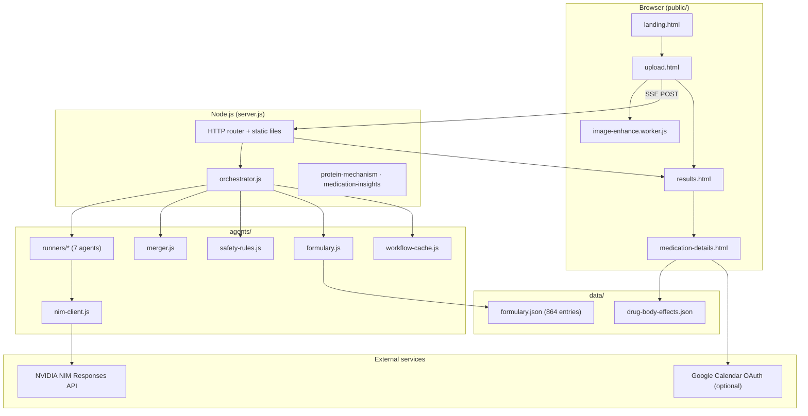

---

## 3. Layered Architecture

```mermaid
flowchart LR
    subgraph Presentation["Presentation layer"]
        P1["HTML pages"]
        P2["ES module page scripts"]
        P3["Shared core modules"]
        P4["Medication viz modules"]
    end

    subgraph Transport["Transport layer"]
        T1["REST JSON endpoints"]
        T2["SSE event stream"]
        T3["Static asset serving"]
    end

    subgraph Application["Application layer"]
        A1["orchestrator.js — staged workflow"]
        A2["merger.js — result contract"]
        A3["merge-medication-runs.js"]
        A4["workflow-cache.js"]
    end

    subgraph Domain["Domain / intelligence layer"]
        D1["Agent runners"]
        D2["prompts.js + schemas.js"]
        D3["medical-context.js — LASA, region hints"]
        D4["safety-rules.js"]
        D5["formulary.js"]
    end

    subgraph Infrastructure["Infrastructure layer"]
        I1["nim-client.js"]
        I2["logger.js"]
        I3["config.js"]
        I4["sse.js"]
    end

    Presentation --> Transport
    Transport --> Application
    Application --> Domain
    Domain --> Infrastructure
```

### 3.1 Directory map

```text
server.js                 HTTP entrypoint, routing, validation, SSE wiring
agents/
  orchestrator.js         Staged pipeline, cache, self-consistency re-run
  nim-client.js           NVIDIA Responses API client (strict JSON schema)
  run-agent.js            Shared runVisionAgent / runTextAgent helpers
  schemas.js              Per-agent strict JSON schemas
  prompts.js              Per-agent system instructions
  medical-context.js      LASA pairs, region directives, user context block
  merger.js               Artifact merge + deterministic summary builder
  safety-rules.js         Deterministic human-review rules
  formulary.js            Fuzzy match + distance-1 auto-correct
  merge-medication-runs.js Self-consistency merge logic
  workflow-cache.js       Content-hash LRU (16 entries, 5 min TTL)
  runners/*.js            One thin runner per agent
  features/*.js           Protein mechanism, body effects, insights
public/
  js/core/                decode-client, image-enhance, shared helpers
  js/pages/               upload, results, medication-details entrypoints
  js/medication/          Schedule, mechanism, tier calculations
  js/medication/charts/   Chart.js + bespoke SVG visualizations
data/
  formulary.json          864 medication names
  drug-body-effects.json  32 body-effect entries
```

---

## 4. Decode Workflow Pipeline

The orchestrator runs agents in **stages**. Parallel stages use `Promise.all`. Critical agents (`raw_transcription`, `medications`) fail the entire workflow on error; others degrade with empty sections.

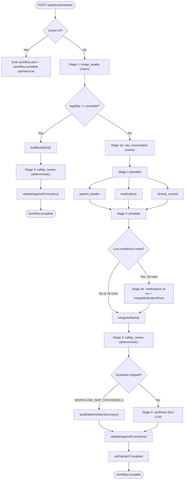

### 4.1 Stage reference

| Stage | Agents                                              | Execution    | Purpose                                                              |
| ----- | --------------------------------------------------- | ------------ | -------------------------------------------------------------------- |
| 1     | `image_quality`                                     | Sequential   | Quality gate; early exit on unusable images                          |
| 1b    | `raw_transcription`                                 | Sequential   | OCR + `region_hint` inference                                        |
| 2     | `patient_header`, `medications`, `clinical_context` | **Parallel** | Structured extraction using transcription + region bias              |
| 2b    | `medications`                                       | Conditional  | Self-consistency re-run when confidence < 0.7 or uncertainty markers |
| 3     | `safety_review`                                     | Sequential   | **Deterministic** rules (not LLM-only)                               |
| 4     | `synthesis`                                         | Sequential   | Plain-language summary (LLM or template)                             |
| Post  | —                                                   | Sequential   | Formulary dedup, fuzzy match, auto-correct                           |

### 4.2 Self-consistency (Stage 2b)

A second `medications` pass runs when any first-pass row has:

- `medication_name_confidence < 0.7`, or
- non-empty `uncertain_tokens` / `critical_uncertainties`

Skipped when more than **6** rows qualify (cost guard). The re-run uses `temperatureNudge` (temperature 0.4) and a focused LASA block from first-pass drug names. `mergeMedicationRuns` decides per line:

| Condition                              | Outcome                                          |
| -------------------------------------- | ------------------------------------------------ |
| Names agree                            | Keep row, `confidence = max(a, b)`               |
| Disagree, second higher + in formulary | Take second pass                                 |
| Otherwise                              | Keep first, flag `low-confidence: runs disagree` |

---

## 5. Request / Response Flow (SSE)

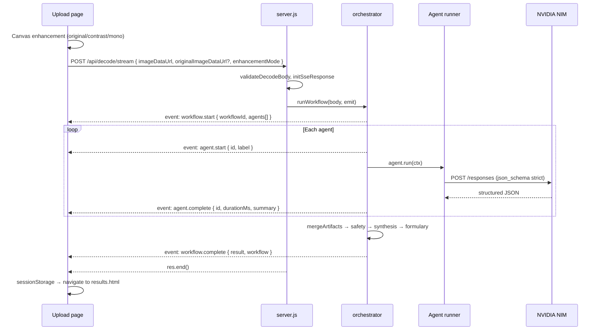

### 5.1 SSE event contract

| Event               | Payload highlights                                                       |
| ------------------- | ------------------------------------------------------------------------ |
| `workflow.start`    | `workflowId`, `agents: [{ id, label }]`                                  |
| `agent.start`       | `id`, `label`                                                            |
| `agent.complete`    | `id`, `durationMs`, `summary`, optional `nimRequestId`                   |
| `agent.error`       | `id`, `message`, optional `rawText` snippet                              |
| `workflow.complete` | `result` (full contract), `workflow: { steps, totalMs, model, cached? }` |
| `workflow.error`    | `message`, optional `agentId`                                            |

All events include `requestId` (mirrors HTTP header `X-Request-ID`).

### 5.2 Decode request body

```json
{
  "imageDataUrl": "data:image/jpeg;base64,...",
  "originalImageDataUrl": "data:image/jpeg;base64,...",
  "fileName": "rx-photo.jpg",
  "enhancementMode": "original | contrast | mono"
}
```

When `enhancementMode !== "original"`, vision agents receive the enhanced image but also get `originalImageDataUrl` for cross-reference.

---

## 6. Agent Design

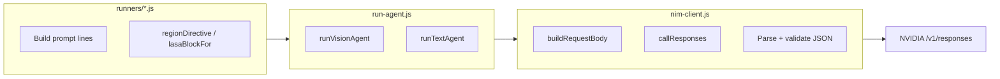

Each agent exports `{ id, label, critical?, deterministic?, run(ctx) }`.

| Agent               | Type          | Critical | Input                           |
| ------------------- | ------------- | -------- | ------------------------------- |
| `image_quality`     | Vision        | No       | Prescription image              |
| `raw_transcription` | Vision        | **Yes**  | Image + quality context         |
| `patient_header`    | Vision        | No       | Image + raw transcription       |
| `medications`       | Vision        | **Yes**  | Image + med lines + region hint |
| `clinical_context`  | Vision        | No       | Image + transcription           |
| `safety_review`     | Deterministic | No       | Merged artifacts                |
| `synthesis`         | Text          | No       | Merged JSON summary input       |

**Prompt cache optimization:** Region directives and user context (`buildUserContextBlock`) are appended to **user content**, not system instructions, so system prompts stay stable across requests.

**Structured output:** All LLM calls use `text.format.type = "json_schema"` with `strict: true`. Reasoning tokens are intentionally omitted on structured calls to avoid consuming `max_output_tokens` before JSON is emitted.

---

## 7. Result Contract

`merger.js` produces the object consumed by `results.js` and `medication-details.js`.

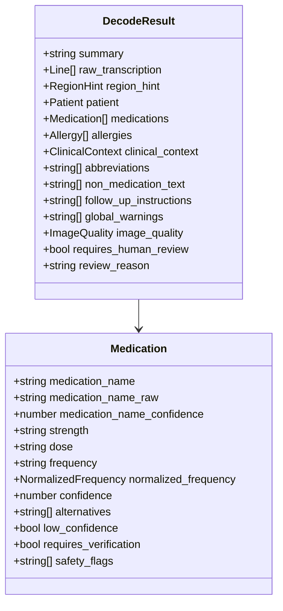

Formulary post-processing (`validateAgainstFormulary`):

1. Dedup medications by `(name|strength|form)`.
2. Per row: distance-1 unambiguous match → promote to `medication_name`, preserve original in `medication_name_raw`.
3. Ambiguous matches → append fuzzy alternatives, leave name unchanged.
4. No match → cap confidence, add validation flag.

---

## 8. Safety Architecture

Safety is layered—no single LLM output is trusted without deterministic checks.

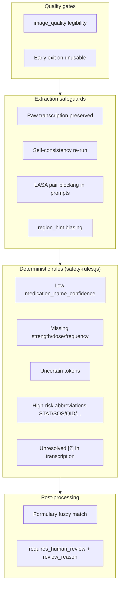

---

## 9. Frontend Architecture

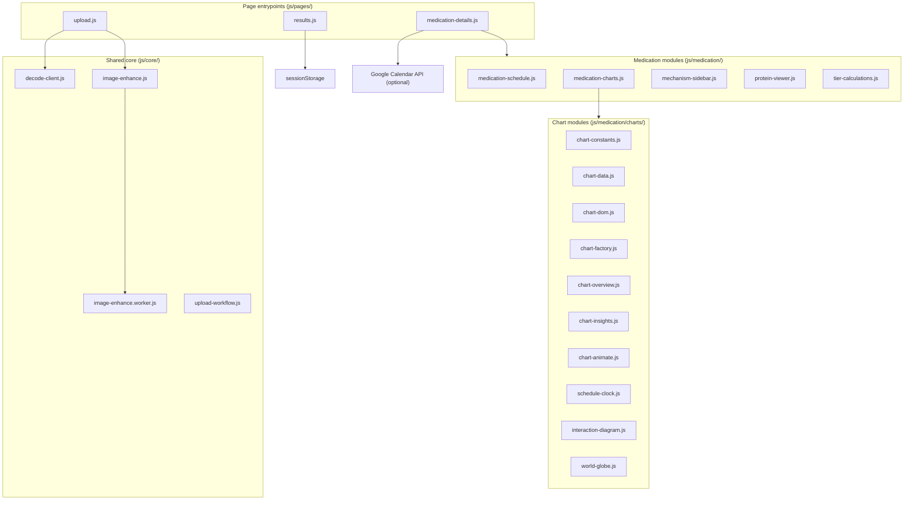

### 9.3 Medication chart architecture

`medication-charts.js` is a **barrel** that re-exports the `charts/` modules and exposes `renderMedicationCharts(med, schedule, instances)`, which delegates to overview and insight renderers. The modules are split by concern so the pure data builders stay testable independent of the DOM and Chart.js.

| Module                  | Responsibility                                                                       |
| ----------------------- | ------------------------------------------------------------------------------------ |
| `chart-constants.js`    | Color palette, default Chart.js options, and the `OVERVIEW_/INSIGHT_/ALL_CHART_IDS`  |
| `chart-data.js`         | **Pure** row builders — PK/steady-state curves, dose times, interaction nodes (no DOM)|
| `chart-dom.js`          | Canvas/container lookup, loading/empty states, chart teardown                        |
| `chart-factory.js`      | Builds Chart.js instances (line/value charts) from data + options                    |
| `chart-overview.js`     | Renders the overview tier (schedule clock)                                           |
| `chart-insights.js`     | Renders the insight tier (PK curve, dose-effect, interaction diagram, world globe)   |
| `chart-animate.js`      | `IntersectionObserver`-driven reveal animation on scroll                             |
| `schedule-clock.js`     | Bespoke **SVG** analog clock plotting daily dose times against live time             |
| `interaction-diagram.js`| Bespoke **SVG** radial severity hub for drug interactions (no native network chart)  |
| `world-globe.js`        | Bespoke **SVG** orthographic globe of where a drug is banned / Rx-only               |

`tier-calculations.js` holds pure helpers (e.g. duration-string parsing) for the 3-tier detail layout. The three SVG visualizations are hand-rolled rather than Chart.js because Chart.js has no native clock, network, or globe chart type.

### 9.1 User journey

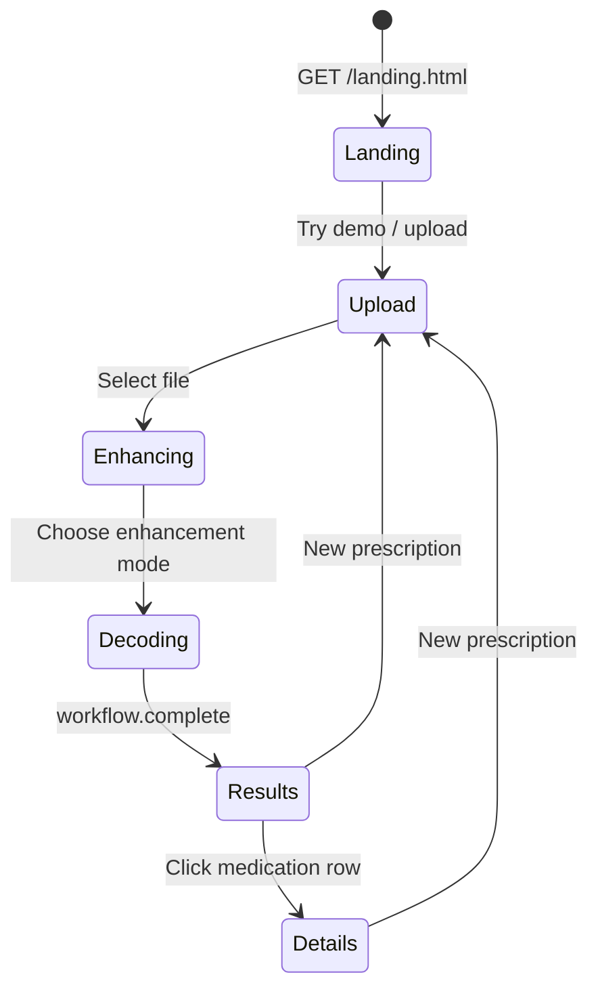

### 9.2 Image enhancement

Client-side canvas processing before upload:

| Mode       | Technique            | Sends original?              |
| ---------- | -------------------- | ---------------------------- |
| `original` | None                 | No                           |
| `contrast` | CLAHE                | Yes (`originalImageDataUrl`) |
| `mono`     | Sauvola binarization | Yes                          |

Heavy processing runs in `image-enhance.worker.js` when available.

---

## 10. Caching

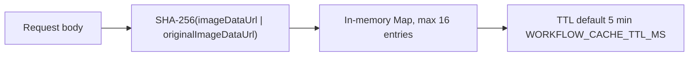

| Behavior      | Detail                                                                                 |
| ------------- | -------------------------------------------------------------------------------------- |
| Disabled when | `WORKFLOW_MOCK=1` or `WORKFLOW_CACHE_DISABLE=1`                                        |
| Cache hit     | Single `workflow.start` + `workflow.complete` with `cached: true`; no per-agent events |
| Stored runs   | Successful, non-early-exit decodes only                                                |

---

## 11. API Surface

| Method | Route                          | Purpose                                   |
| ------ | ------------------------------ | ----------------------------------------- |
| `GET`  | `/api/config`                  | Key status, model, agent list, mock flag  |
| `POST` | `/api/decode/stream`           | **Primary** — SSE workflow + final result |
| `POST` | `/api/decode`                  | Batch decode; JSON + `events[]`           |
| `POST` | `/api/protein-mechanism`       | Protein target + mechanism explanation    |
| `POST` | `/api/medication-insights`     | Supplementary medication insights         |
| `GET`  | `/data/drug-body-effects.json` | Body-effect reference data                |
| `GET`  | `/api/samples`                 | List sample prescription images           |

Static pages: `/landing.html`, `/upload.html`, `/results.html`, `/medication-details.html`.

---

## 12. Configuration

| Variable                    | Default                               | Purpose                             |
| --------------------------- | ------------------------------------- | ----------------------------------- |
| `NVIDIA_API_KEY`            | —                                     | Required for live decode            |
| `NVIDIA_API_BASE_URL`       | `https://inference-api.nvidia.com/v1` | NIM endpoint                        |
| `NVIDIA_MODEL`              | `openai/openai/gpt-5.5`               | Model ID                            |
| `WORKFLOW_MOCK`             | `0`                                   | Fixture mode, no API calls          |
| `WORKFLOW_AGENT_TIMEOUT_MS` | `90000`                               | Per-agent timeout                   |
| `WORKFLOW_SKIP_SYNTHESIS`   | `0`                                   | Deterministic summary via merger    |
| `WORKFLOW_CACHE_DISABLE`    | `0`                                   | Disable LRU cache                   |
| `WORKFLOW_CACHE_TTL_MS`     | `300000`                              | Cache TTL (5 min)                   |
| `WORKFLOW_LOG`              | on                                    | Workflow/NIM terminal logs          |
| `LOG_LEVEL`                 | `info`                                | `debug` · `info` · `warn` · `error` |
| `GOOGLE_CLIENT_ID`          | —                                     | Optional Calendar OAuth             |

---

## 13. Deployment Topology

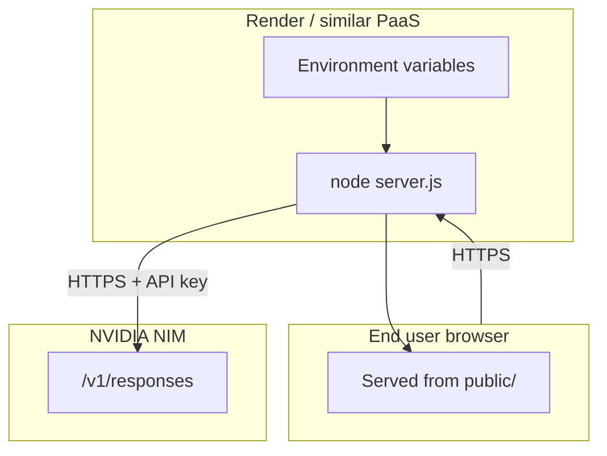

- **Stateless:** No database; in-memory workflow cache only (per instance).
- **Security headers:** CSP, `X-Frame-Options: DENY`, `X-Content-Type-Options: nosniff`.
- **Limits:** Max body 32 MB; max image 10 MB.
- **CI:** GitHub Actions — lint, Prettier, 47 unit tests, 8 Playwright e2e tests (`WORKFLOW_MOCK=1`).

---

## 14. Testing Strategy

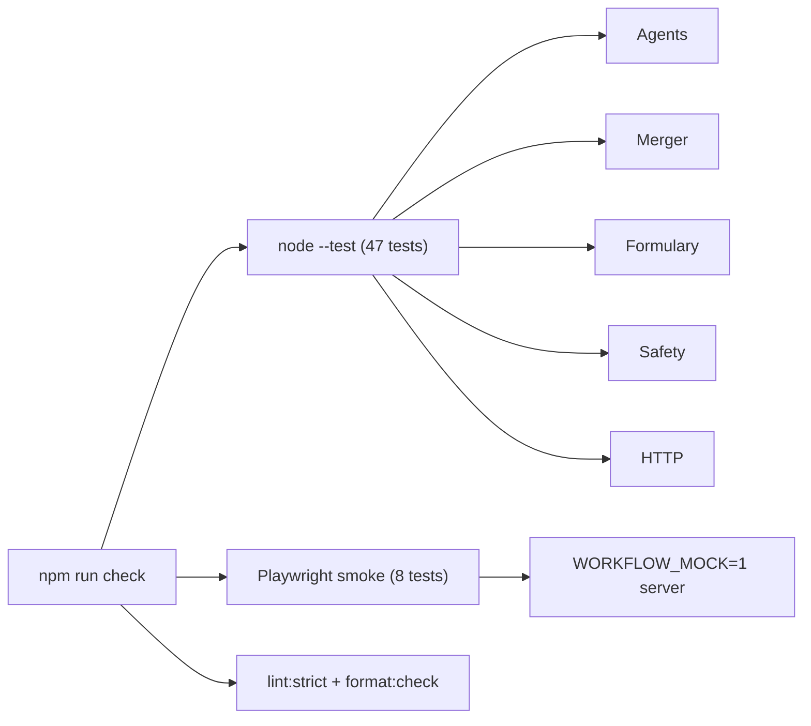

Mock fixtures live in `agents/mock-fixtures.js` and mirror the strict result contract.

---

## 15. Extension Points

When adding or changing behavior, update these together:

1. **Schema** — `agents/schemas.js` (every property in `properties` + `required`, `additionalProperties: false`)
2. **Prompt** — `agents/prompts.js`
3. **Runner** — `agents/runners/<agent>.js`
4. **Merger** — `agents/merger.js`
5. **Mock** — `agents/mock-fixtures.js`
6. **Frontend** — `public/js/pages/results.js`, `medication-details.js`

New LLM agents should use `runVisionAgent` / `runTextAgent` from `run-agent.js` rather than calling `callResponses` directly—they handle context blocks and `lastNimRequestId` telemetry.

---

## 16. Disclaimer

**Transcription aid only — not a clinical decision system.** All medication data must be verified by a licensed clinician or pharmacist before clinical use.
